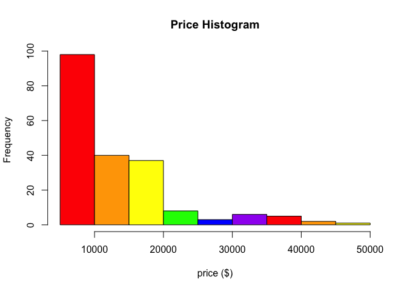
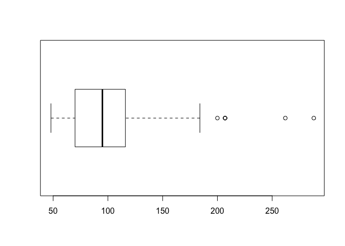
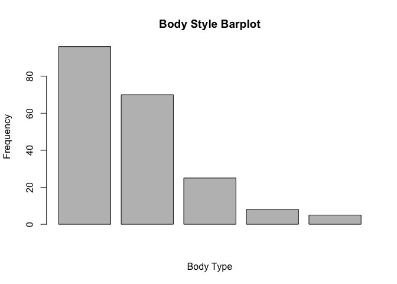
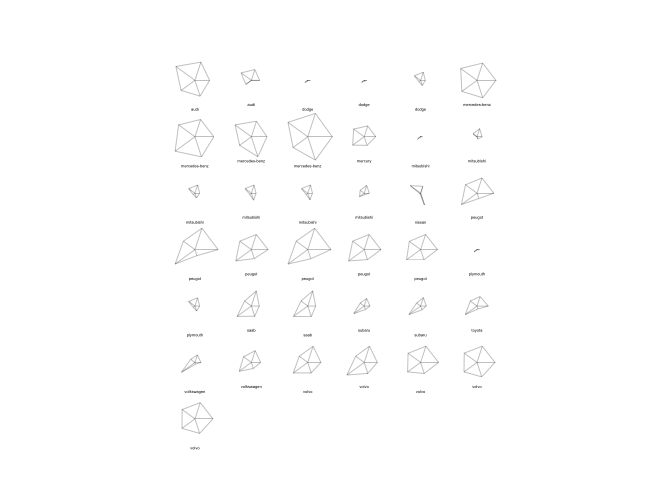
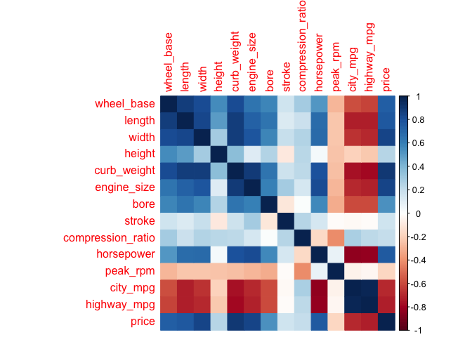
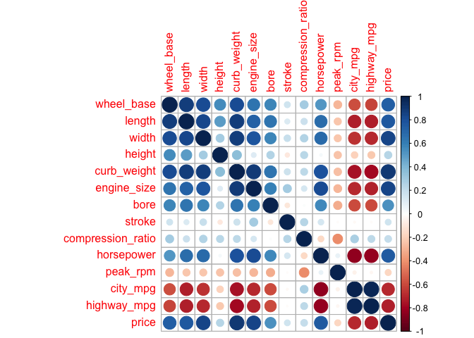
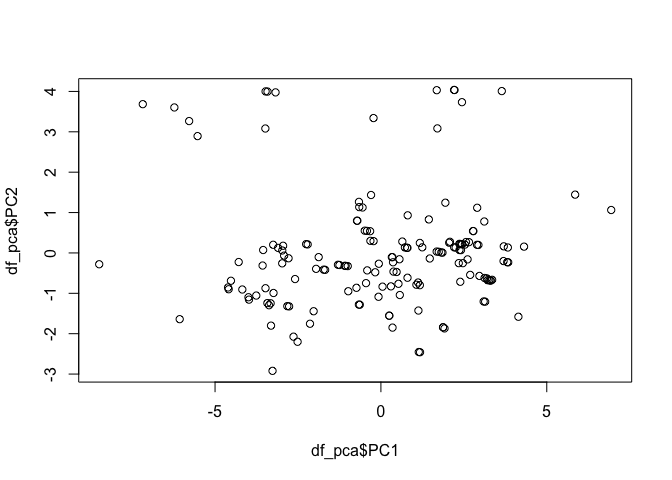
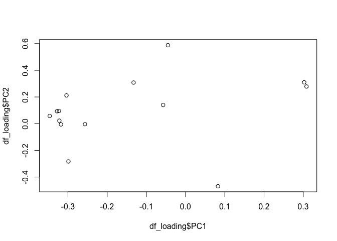

hw01-lindsey-chung.Rmd
================

Data Import
-----------

``` r
column_names = c(
  'symboling',
  'normalized_losses',
  'make',
  'fuel_type',
  'aspiration',
  'num_of_doors',
  'body_style',
  'drive_sheels',
  'engine_location',
  'wheel_base',
  'length',
  'width',
  'height',
  'curb_weight',
  'engine_type',
  "num_of_cylanders",
  'engine_size',
  'fuel_system',
  'bore',
  'stroke',
  'compression_ratio',
  'horsepower',
  'peak_rpm',
  'city_mpg',
  'highway_mpg',
  'price'
)

column_types = c(
  'double',
  'double',
  'character',
  'character',
  'character',
  'character',
  'character',
  'character',
  'character',
  'double',
  'double',
  'double',
  'double',
  'integer',
  'character',
  'character',
  'integer',
  'character',
  'double',
  'double',
  'double',
  'integer',
  'integer',
  'integer',
  'integer',
  'integer'
)

cars = read.csv(
  'imports-85.data',
  stringsAsFactors = FALSE,
  col.names = column_names,
  colClasses = column_types,
  na.strings = '?'
)

str(cars)
```

    ## 'data.frame':    204 obs. of  26 variables:
    ##  $ symboling        : num  3 1 2 2 2 1 1 1 0 2 ...
    ##  $ normalized_losses: num  NA NA 164 164 NA 158 NA 158 NA 192 ...
    ##  $ make             : chr  "alfa-romero" "alfa-romero" "audi" "audi" ...
    ##  $ fuel_type        : chr  "gas" "gas" "gas" "gas" ...
    ##  $ aspiration       : chr  "std" "std" "std" "std" ...
    ##  $ num_of_doors     : chr  "two" "two" "four" "four" ...
    ##  $ body_style       : chr  "convertible" "hatchback" "sedan" "sedan" ...
    ##  $ drive_sheels     : chr  "rwd" "rwd" "fwd" "4wd" ...
    ##  $ engine_location  : chr  "front" "front" "front" "front" ...
    ##  $ wheel_base       : num  88.6 94.5 99.8 99.4 99.8 ...
    ##  $ length           : num  169 171 177 177 177 ...
    ##  $ width            : num  64.1 65.5 66.2 66.4 66.3 71.4 71.4 71.4 67.9 64.8 ...
    ##  $ height           : num  48.8 52.4 54.3 54.3 53.1 55.7 55.7 55.9 52 54.3 ...
    ##  $ curb_weight      : int  2548 2823 2337 2824 2507 2844 2954 3086 3053 2395 ...
    ##  $ engine_type      : chr  "dohc" "ohcv" "ohc" "ohc" ...
    ##  $ num_of_cylanders : chr  "four" "six" "four" "five" ...
    ##  $ engine_size      : int  130 152 109 136 136 136 136 131 131 108 ...
    ##  $ fuel_system      : chr  "mpfi" "mpfi" "mpfi" "mpfi" ...
    ##  $ bore             : num  3.47 2.68 3.19 3.19 3.19 3.19 3.19 3.13 3.13 3.5 ...
    ##  $ stroke           : num  2.68 3.47 3.4 3.4 3.4 3.4 3.4 3.4 3.4 2.8 ...
    ##  $ compression_ratio: num  9 9 10 8 8.5 8.5 8.5 8.3 7 8.8 ...
    ##  $ horsepower       : int  111 154 102 115 110 110 110 140 160 101 ...
    ##  $ peak_rpm         : int  5000 5000 5500 5500 5500 5500 5500 5500 5500 5800 ...
    ##  $ city_mpg         : int  21 19 24 18 19 19 19 17 16 23 ...
    ##  $ highway_mpg      : int  27 26 30 22 25 25 25 20 22 29 ...
    ##  $ price            : int  16500 16500 13950 17450 15250 17710 18920 23875 NA 16430 ...

``` r
library(readr)

cars2 = read_csv(
  'imports-85.data',
  col_names = column_names,
  col_types = cols('d', 'd', 'c', 'c', 'c', 'c', 'c', 'c', 'c', 'd', 'd', 'd', 'd', 'i', 'c', 'c', 'i', 'c', 'd', 'd', 'd', 'i', 'i', 'i', 'i' ,'i')
)
```

    ## Warning in rbind(names(probs), probs_f): number of columns of result is not
    ## a multiple of vector length (arg 1)

    ## Warning: 57 parsing failures.
    ## row # A tibble: 5 x 5 col     row col               expected actual file              expected   <int> <chr>             <chr>    <chr>  <chr>             actual 1     1 normalized_losses a double ?      'imports-85.data' file 2     2 normalized_losses a double ?      'imports-85.data' row 3     3 normalized_losses a double ?      'imports-85.data' col 4     6 normalized_losses a double ?      'imports-85.data' expected 5     8 normalized_losses a double ?      'imports-85.data'
    ## ... ................. ... ........................................................... ........ ........................................................... ...... ........................................................... .... ........................................................... ... ........................................................... ... ........................................................... ........ ...........................................................
    ## See problems(...) for more details.

``` r
str(cars2)
```

    ## Classes 'tbl_df', 'tbl' and 'data.frame':    205 obs. of  26 variables:
    ##  $ symboling        : num  3 3 1 2 2 2 1 1 1 0 ...
    ##  $ normalized_losses: num  NA NA NA 164 164 NA 158 NA 158 NA ...
    ##  $ make             : chr  "alfa-romero" "alfa-romero" "alfa-romero" "audi" ...
    ##  $ fuel_type        : chr  "gas" "gas" "gas" "gas" ...
    ##  $ aspiration       : chr  "std" "std" "std" "std" ...
    ##  $ num_of_doors     : chr  "two" "two" "two" "four" ...
    ##  $ body_style       : chr  "convertible" "convertible" "hatchback" "sedan" ...
    ##  $ drive_sheels     : chr  "rwd" "rwd" "rwd" "fwd" ...
    ##  $ engine_location  : chr  "front" "front" "front" "front" ...
    ##  $ wheel_base       : num  88.6 88.6 94.5 99.8 99.4 ...
    ##  $ length           : num  169 169 171 177 177 ...
    ##  $ width            : num  64.1 64.1 65.5 66.2 66.4 66.3 71.4 71.4 71.4 67.9 ...
    ##  $ height           : num  48.8 48.8 52.4 54.3 54.3 53.1 55.7 55.7 55.9 52 ...
    ##  $ curb_weight      : int  2548 2548 2823 2337 2824 2507 2844 2954 3086 3053 ...
    ##  $ engine_type      : chr  "dohc" "dohc" "ohcv" "ohc" ...
    ##  $ num_of_cylanders : chr  "four" "four" "six" "four" ...
    ##  $ engine_size      : int  130 130 152 109 136 136 136 136 131 131 ...
    ##  $ fuel_system      : chr  "mpfi" "mpfi" "mpfi" "mpfi" ...
    ##  $ bore             : num  3.47 3.47 2.68 3.19 3.19 3.19 3.19 3.19 3.13 3.13 ...
    ##  $ stroke           : num  2.68 2.68 3.47 3.4 3.4 3.4 3.4 3.4 3.4 3.4 ...
    ##  $ compression_ratio: num  9 9 9 10 8 8.5 8.5 8.5 8.3 7 ...
    ##  $ horsepower       : int  111 111 154 102 115 110 110 110 140 160 ...
    ##  $ peak_rpm         : int  5000 5000 5000 5500 5500 5500 5500 5500 5500 5500 ...
    ##  $ city_mpg         : int  21 21 19 24 18 19 19 19 17 16 ...
    ##  $ highway_mpg      : int  27 27 26 30 22 25 25 25 20 22 ...
    ##  $ price            : int  13495 16500 16500 13950 17450 15250 17710 18920 23875 NA ...
    ##  - attr(*, "problems")=Classes 'tbl_df', 'tbl' and 'data.frame': 57 obs. of  5 variables:
    ##   ..$ row     : int  1 2 3 6 8 10 10 15 16 17 ...
    ##   ..$ col     : chr  "normalized_losses" "normalized_losses" "normalized_losses" "normalized_losses" ...
    ##   ..$ expected: chr  "a double" "a double" "a double" "a double" ...
    ##   ..$ actual  : chr  "?" "?" "?" "?" ...
    ##   ..$ file    : chr  "'imports-85.data'" "'imports-85.data'" "'imports-85.data'" "'imports-85.data'" ...
    ##  - attr(*, "spec")=List of 2
    ##   ..$ cols   :List of 26
    ##   .. ..$ symboling        : list()
    ##   .. .. ..- attr(*, "class")= chr  "collector_double" "collector"
    ##   .. ..$ normalized_losses: list()
    ##   .. .. ..- attr(*, "class")= chr  "collector_double" "collector"
    ##   .. ..$ make             : list()
    ##   .. .. ..- attr(*, "class")= chr  "collector_character" "collector"
    ##   .. ..$ fuel_type        : list()
    ##   .. .. ..- attr(*, "class")= chr  "collector_character" "collector"
    ##   .. ..$ aspiration       : list()
    ##   .. .. ..- attr(*, "class")= chr  "collector_character" "collector"
    ##   .. ..$ num_of_doors     : list()
    ##   .. .. ..- attr(*, "class")= chr  "collector_character" "collector"
    ##   .. ..$ body_style       : list()
    ##   .. .. ..- attr(*, "class")= chr  "collector_character" "collector"
    ##   .. ..$ drive_sheels     : list()
    ##   .. .. ..- attr(*, "class")= chr  "collector_character" "collector"
    ##   .. ..$ engine_location  : list()
    ##   .. .. ..- attr(*, "class")= chr  "collector_character" "collector"
    ##   .. ..$ wheel_base       : list()
    ##   .. .. ..- attr(*, "class")= chr  "collector_double" "collector"
    ##   .. ..$ length           : list()
    ##   .. .. ..- attr(*, "class")= chr  "collector_double" "collector"
    ##   .. ..$ width            : list()
    ##   .. .. ..- attr(*, "class")= chr  "collector_double" "collector"
    ##   .. ..$ height           : list()
    ##   .. .. ..- attr(*, "class")= chr  "collector_double" "collector"
    ##   .. ..$ curb_weight      : list()
    ##   .. .. ..- attr(*, "class")= chr  "collector_integer" "collector"
    ##   .. ..$ engine_type      : list()
    ##   .. .. ..- attr(*, "class")= chr  "collector_character" "collector"
    ##   .. ..$ num_of_cylanders : list()
    ##   .. .. ..- attr(*, "class")= chr  "collector_character" "collector"
    ##   .. ..$ engine_size      : list()
    ##   .. .. ..- attr(*, "class")= chr  "collector_integer" "collector"
    ##   .. ..$ fuel_system      : list()
    ##   .. .. ..- attr(*, "class")= chr  "collector_character" "collector"
    ##   .. ..$ bore             : list()
    ##   .. .. ..- attr(*, "class")= chr  "collector_double" "collector"
    ##   .. ..$ stroke           : list()
    ##   .. .. ..- attr(*, "class")= chr  "collector_double" "collector"
    ##   .. ..$ compression_ratio: list()
    ##   .. .. ..- attr(*, "class")= chr  "collector_double" "collector"
    ##   .. ..$ horsepower       : list()
    ##   .. .. ..- attr(*, "class")= chr  "collector_integer" "collector"
    ##   .. ..$ peak_rpm         : list()
    ##   .. .. ..- attr(*, "class")= chr  "collector_integer" "collector"
    ##   .. ..$ city_mpg         : list()
    ##   .. .. ..- attr(*, "class")= chr  "collector_integer" "collector"
    ##   .. ..$ highway_mpg      : list()
    ##   .. .. ..- attr(*, "class")= chr  "collector_integer" "collector"
    ##   .. ..$ price            : list()
    ##   .. .. ..- attr(*, "class")= chr  "collector_integer" "collector"
    ##   ..$ default: list()
    ##   .. ..- attr(*, "class")= chr  "collector_guess" "collector"
    ##   ..- attr(*, "class")= chr "col_spec"

Technical Questions about Importing Data
----------------------------------------

1.  the first row becomes column names
2.  the program will make some generic column names (V1, V2, V3, etc.)
3.  the data type is assumed to be character
4.  the default data types take the least amount of memory. Any changes, such as specifying data types, will only add to the necessary memory because it will take memory to make this change
5.  since matrices are atomic, all the values are converted into characters

Practice Base Plotting
----------------------

``` r
hist(
  cars[ , 'price'],
  main = 'Price Histogram',
  xlab = 'price ($)',
  col = c('red', 'orange', 'yellow', 'green', 'blue', 'purple', 'red', 'orange', 'yellow')
)
```



``` r
boxplot(
  cars[ , 'horsepower'],
  horizontal = TRUE
)
```



``` r
library(plyr)
body_freq = data.frame(table(cars[ , 'body_style']))
ordered_body_freq = body_freq[order(body_freq[ , 2], decreasing = TRUE), ]
barplot(
  ordered_body_freq$Freq,
  #names.arg = ordered_body_freq$Var1,
  cex.names = 0.76,
  xlab = 'Body Type',
  ylab = 'Frequency',
  main = "Body Style Barplot"
)
```



``` r
stars(
  cars[cars$aspiration == 'turbo', c('wheel_base', 'length', 'width', 'height', 'price')],
  labels = cars[cars$aspiration == 'turbo', 'make'],
  cex = 0.25
)
```



Summaries
---------

``` r
mean(cars[cars$fuel_type == 'gas', 'price'], na.rm = TRUE)
```

    ## [1] 12913.19

``` r
mean(cars[cars$fuel_type == 'diesel', 'price'], na.rm = TRUE)
```

    ## [1] 15838.15

``` r
cars[cars$num_of_cylanders == 'twelve', 'make']
```

    ## [1] "jaguar"

``` r
library(plyr)
diesel = cars[cars$fuel_type == 'diesel', 'make']
diesel_count = table(diesel)
diesel_count[which.max(diesel_count)]
```

    ## peugot 
    ##      5

``` r
cars[which.max(cars$horsepower), 'price']
```

    ## [1] NA

``` r
tail(cars[order(cars$city_mpg, decreasing = TRUE), 'city_mpg'], n = nrow(cars) / 10)
```

    ##  [1] 17 17 17 17 17 17 17 17 17 16 16 16 16 16 16 15 15 15 14 14 13

``` r
head(cars[order(cars$highway_mpg, decreasing = TRUE), 'highway_mpg'], n = nrow(cars) / 10)
```

    ##  [1] 54 53 50 47 47 46 46 43 43 43 43 42 42 42 41 41 41 39 39 38

``` r
median(tail(cars[order(cars$city_mpg, decreasing = TRUE), 'price'], n = nrow(cars) / 10), na.rm = TRUE)
```

    ## [1] 34028

Technical Questions about Data Frames
-------------------------------------

1.  the program returns NULL
2.  4
3.  mpg is the name of a column in a data frame, not an object. Thus, it can not be found if not in quotation marks.
4.  Yes. Data frames are made of ????
5.  Each column is made into a list and is separated from the rest of the lists
6.  as.data.frame(abc)

Correlations of Quantitative Variables
--------------------------------------

``` r
qdat = Filter(is.numeric, na.omit(cars))[ , c(-1, -2)]
correlation = cor(qdat)

library(corrplot)
```

    ## corrplot 0.84 loaded

``` r
corrplot(correlation, method = 'color')
```



``` r
corrplot(correlation, method = 'circle')
```



There seem to be generally positive correlations between wheel base, length, width, height, curbweight, engine size, and bore. There is also a very strong positive correlation between city mpg and highway mpg. There are negative correlations between mpg and length, width, curb weight, and engine size.

Principal Components Analysis
-----------------------------

``` r
pca_cars = prcomp(
  qdat,
  scale. = TRUE
)

eigenvalues = pca_cars$sdev^2
eigenvalues
```

    ##  [1] 7.78036168 2.04609771 1.31815775 0.88723082 0.56546244 0.39095199
    ##  [7] 0.27618337 0.22164907 0.14783726 0.12214670 0.08942773 0.08612020
    ## [13] 0.04580215 0.02257113

``` r
proportion = sum(eigenvalues[1:3]) / sum(eigenvalues)
proportion
```

    ## [1] 0.7960441

``` r
df_pca = data.frame(pca_cars$x)

plot(
  df_pca$PC1,
  df_pca$PC2,
  type = 'p'
)
```



``` r
df_loading = data.frame(pca_cars$rotation)

plot(
  df_loading$PC1,
  df_loading$PC2,
  type = 'p'
)
```



The first vector has a greater eigenvalue and therefore is more representative of the data. There are a lot of points that are very close, meaning that there are lot of car individuals that are more or less similar in lots of ways.
